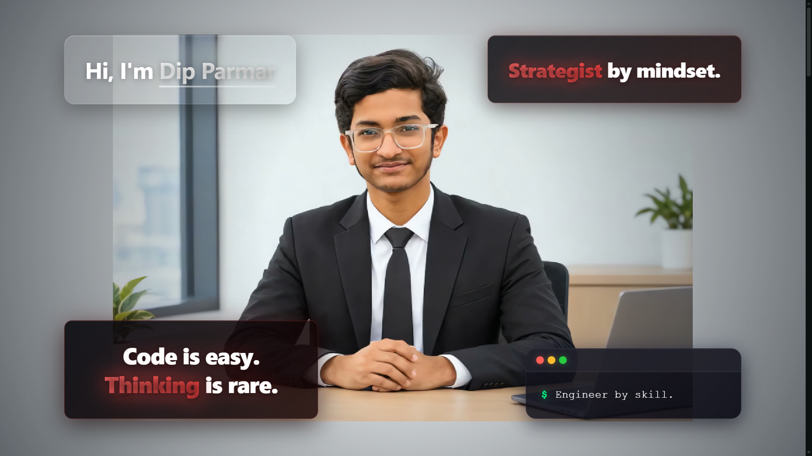
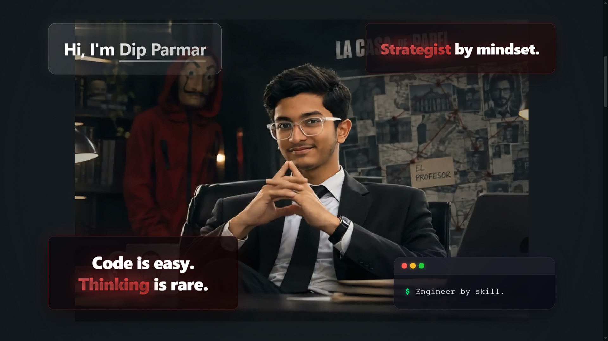
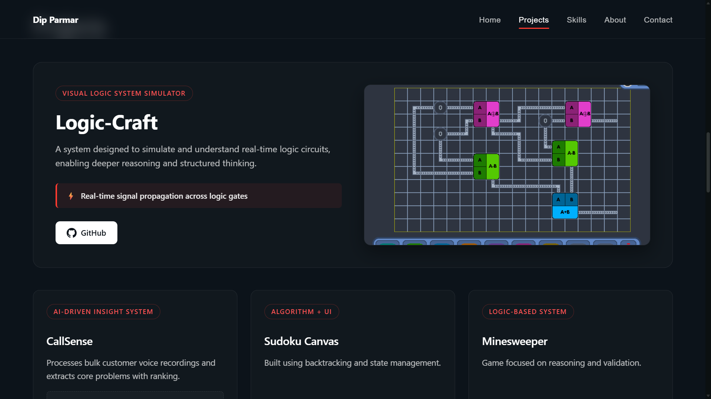
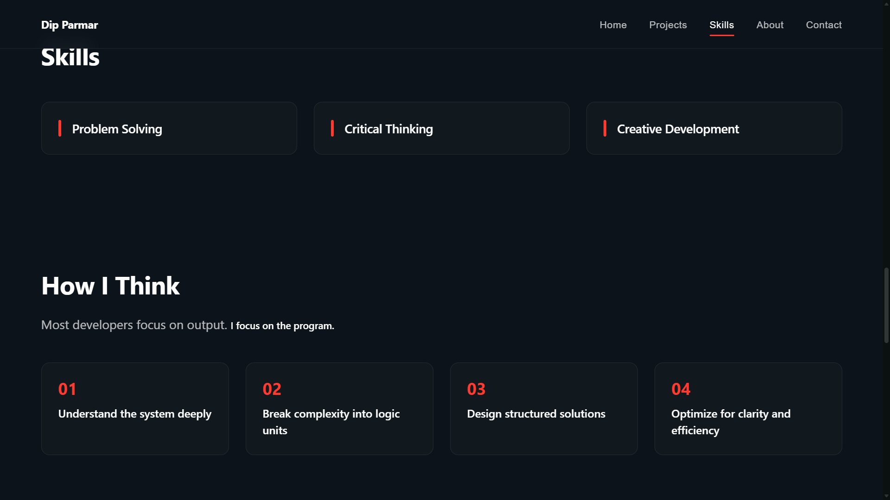

# Dip Parmar Portfolio

"Thinking beyond code."

A cinematic, scroll-driven portfolio where user scroll controls animation frame-by-frame to create an immersive storytelling experience.

## Preview

<div align="center">
  
  
  
  
</div>

## Features

- Scroll-controlled frame animation
- Frame-based rendering (not video)
- Smooth background color transitions
- Cinematic UI overlay cards (storytelling)
- Final scroll lock with button-triggered transition
- Desktop responsive design

## Live Demo
> **Note:** Only work on desktop <br>
[](https://dip-parmar-portfolio.netlify.app/)

## Project Philosophy

**"Most developers focus on output. I focus on the program."**

- Focus on logic and structure
- Understanding systems deeply
- Designing how things work, not just UI

## Tech Stack

- React
- Vite
- GSAP (ScrollTrigger)
- Canvas API

## How It Works

- 120 frames (24 FPS)
- Scroll mapped to frame index
- Canvas rendering for smooth playback
- Preloading for performance

## Project Structure

- `src` → components, hooks, logic
- `public/frames` → animation frames
- `public/images` → assets

## Setup

```bash
npm install
npm run dev
```

## Build

```bash
npm run build
```

## Author

**Dip Parmar**  
GitHub: [TechnicalCoderji](https://github.com/TechnicalCoderji)  
LinkedIn: [Dip Parmar](https://www.linkedin.com/in/dip-parmar-299792458-ms)  
Email: dipparmar4637@gmail.com

## License

This project is licensed under the MIT License — see the [LICENSE](LICENSE) file for details.
